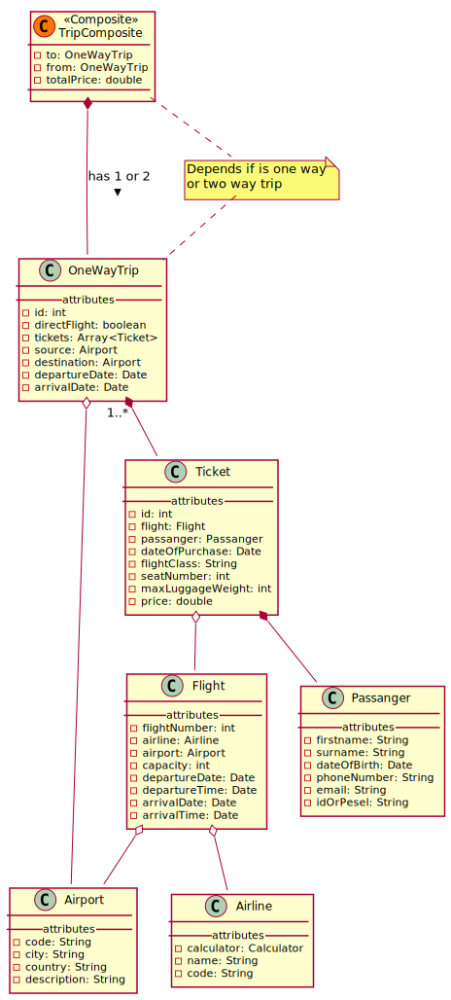

# frontend

### Run project
##### Step 1:
Make sure you have installed node. Then run ```npm install``` to install all dependencies.

#### Step 2:
Run ```ng serve -o```
This will automatically open your browser on 'localhost:4200'


### Swagger API documentation
After running [backend project](https://github.com/siwz2020/backend) (!) enter following url:
```http://localhost:8080/swagger-ui.html```

### Simplified model diagram



You can modify diagrams by editing ```*.plantuml```